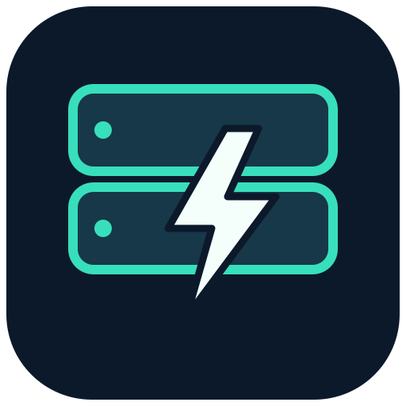

# Super Lan-Cache

[Download & install](https://github.com/HDR-Performance/super-lan-cache/releases) · [TrueNAS guide](docs/TRUENAS.md) · [Super Pi Hole](https://github.com/HDR-Performance/super-pi-hole)

An all-in-one LanCache engine, management API, and web interface. One container and one TrueNAS app. Super Pi Hole is optional and is never required for startup, authentication, storage, caching, or maintenance.

## Features

- Responsive dark/light interface with optional password protection: overview, cache library, live activity, versions, services/DNS, settings, and maintenance.
- SQLite inventory reads real NGINX cache headers and verifies each MD5 cache key. Cache bytes and file counts are measured from resident files, separately from request history.
- Existing caches scan automatically on startup. Results are partial while scanning. Download completions trigger a subsequent scan; unchanged files reuse verified header information. Periodic reconciliation runs every 30 minutes; manual scanning is also available.
- Persistent log offsets avoid double counting across restarts. Live request completions and container network traffic update every two seconds. Historical import progress is visible. Container network traffic includes both origin and client traffic.
- Steam depot IDs, optional community Steam title lookup, Xbox package versions when exposed in URLs, publisher/service groups, custom display names, and search.
- Selected cache removal has an expiring preview, explicit confirmation, path/key/inode/size checks, protected manifest references, idle-engine checking, graceful NGINX stop, restart, and an operation record.
- Real engine settings: disk allowance, index memory, minimum free disk, retention/validity, origin DNS resolvers, and worker count. Settings are validated with `nginx -t`, persist under the manager volume, and roll back after failure.
- Independent dnsmasq rule export and optional scoped, revocable Super Pi Hole pairing.

## Content identity and versions

LanCache stores HTTP chunks, not installed games. Steam content usually identifies a depot, not a full game build. A cached group is not proof that a complete game is present. Unknown titles/versions remain unknown. HTTPS payloads pass through uncached.

The library supports manual deletion of selected content groups. Exclusive version removal requires imported complete manifests containing actual NGINX MD5 filenames. References shared with retained manifests are protected. Completeness is based on the supplied metadata; arbitrary publisher hashes are not accepted as NGINX filenames. Automatic discovery of every publisher's latest version is not implemented.

Steam name refresh downloads the public `regix1/lancache-pics` mapping. It does not upload the library, download games, or establish version ownership. Its source, timestamp, and digest are recorded.

## Standalone installation

1. Copy `.env.example` to `.env` and set your LAN address. Review storage in `compose.yaml`.
2. Run `docker compose up -d` using the published image, or build from source with `docker compose -f compose.yaml -f compose.build.yaml up -d --build`.
3. New installations open without a password. Set one later under Settings → Password protection, or explicitly supply `GUI_INITIAL_PASSWORD` on first startup to require login immediately. Existing saved passwords remain enabled after upgrades.
4. Open the configured `GUI_PUBLIC_ORIGIN`. Settings includes controls to enable, change, or turn off password protection. In no-login mode, anyone who can reach that management address can use its controls.
5. Configure a separate DNS server for the selected cache domains. The engine's origin resolver must resolve the actual Internet servers, not route back to the cache.

Only HTTP(S) management origins are supported. The configured host is required by the rebinding guard. To use HTTPS, configure an appropriate trusted reverse proxy and set the public origin accordingly.

Persistent mounts:

| Container path | Contents |
|---|---|
| `/data/cache` | Existing NGINX cache, `CONFIGHASH`, chunk directory |
| `/data/logs` | HTTP/SNI logs |
| `/data/manager` | SQLite inventory/history, password hash, integration state, persistent engine settings |

The container controls its own NGINX through a root-only supervisor socket. It does not mount the Docker socket or use NAS administrator/SSH credentials. The supervisor socket does not listen on TCP.

GUI engine overrides become authoritative after initialization; changing an overridden environment variable alone will not replace the saved GUI setting. Use Settings for those six controls. Image updates, ports, mounts, and resource limits remain TrueNAS/Docker lifecycle operations.

## TrueNAS

See [installation, existing-cache migration and rollback](docs/TRUENAS.md).

## Optional integration API

In Super Lan-Cache Settings choose **Create setup code**. Paste the complete code into Super Pi Hole → Settings & tools → Integrations → Quick setup. Choose **Steam**, **PC gaming**, or **All supported services**, then **Connect & prepare preset**. The apps exchange the cache address and domain catalog automatically; review and enable the prepared DNS rules. A preset adds to existing enabled services.

The same-server shortcut uses port 20721 for Super Pi Hole and 20722 for LanCache. Across the LAN, open the other server's interface; the setup code includes the actual configured LanCache management origin, including custom ports. The integration currently requires a private IP address for the LanCache management URL; hostname-based reverse proxies need the manual private-IP origin configuration. Copy `.env.example` to `.env` and set `LANCACHE_SERVER_IP` once for a standard Compose installation.

Setup codes contain a unique read-only credential, not a shared default password. Replacing a code invalidates the prior token, so existing peers must import the replacement. Neither app requires the other. Devices must use the selected DNS server; VPN or encrypted DNS may bypass it. Restart Steam after enabling its discovery rule. Origin DNS stays independent to avoid a cache loop.

Bearer endpoints: `/api/integrations/v1/identity`, `/status`, `/services`. Identity advertises `apiVersion: 1`, product `lancache`, stable `instanceId`, and `status.read` / `services.read`. Status contains engine health, ISO sample time, content IP addresses, and management URL. Services contains a catalog revision and typed exact/wildcard domains.

## Development and verification

Requires Node 24. No npm dependencies are required. Run `npm run check` and `npm test`. Running without `GUI_MANAGED=true` provides a local interface with engine control and deletion disabled.

Validation covers cache-key/header parsing, history restart deduplication, inventory reconciliation, protected/shared references, verified deletion, tampered paths and files, authentication/CSRF, pairing schemas/revocation, settings rollback, and active-download guards. TrueNAS validation additionally exercises real NGINX MISS/HIT transfers, indexing, deletion/refetch, saved settings across redeploy, and browser settings controls.

Upstream monolithic source is vendored at `b9213a93cd2190fec920d5b087d067360aebc0c8`; cache-domains at `170c0905e4d5230833a1854b896299c743c3059e`. Release images and installation assets record an immutable image digest; base-image updates require a new tested build. Upstream licenses remain with their vendored files. No code from the separately researched AGPL LanCache Manager was incorporated.
